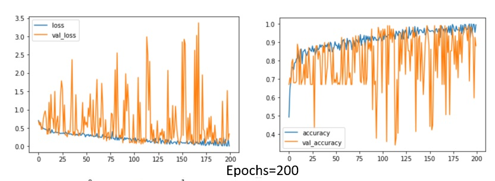
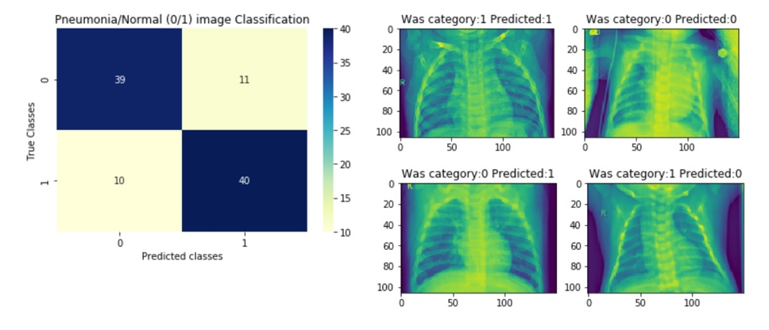

# X-ray-Image-Recognition-as-Pneumonia-or-Normal
Artificial intelligence (AI) in healthcare has been growing rapidly. It has the potential to revolutionize disease diagnosis and management by rapidly reviewing large amounts of images and performing classifications difficult for professionals.
The capacity to classify images and identify objects in a picture has improved significantly as a result of the development of convolutional neural network layers. Convolutional filters, or numerous processing layers, are used to analyze images. Each layer's abstract representation of the images is created by sequential convolution of a number of filters across the image to create a feature map that serves as the input for the layer below. This architecture enables the processing of images as input in the form of pixels and the output of the desired classification. 
Apache Spark (via Databricks) is an open source software used for processing and analyzing a large amount of data. It works through distributing the data across the cluster and processing it in parallel. Spark encourages models that can operate on clusters and enables data analysts to quickly and effectively recognise images. Spark is incredibly rapid, supports a wide range of programming languages, incorporates the value of machine learning, and links to numerous platforms.

Databricks free community edition was used for implementing x-ray image classification. However since image processing is heavy on resource utilization, implementing a deep learning neural network classification model in spark for images in databricks was extremely challenging. Due to which a very small dataset was tested i.e 540 images for training and 100 images for testing. These images were resized (150X106) in order to stay within the limits of memory utilisation available in databricks. Tensorflow’s Keras library in python was used for CNN models with different convolution layers. A convolution multiplies a matrix of pixels with a filter matrix or ‘kernel’ and sums up the multiplication values. Then the convolution slides over to the next pixel and repeats the same process until all the image pixels have been covered.
However the model training wasn't as good which was expected due to the challenges faced while working in databricks platform. Some of the challenges were:

<ul>
  <li>The Community Edition sort of simulates distributed computing by providing 2 nodes, which means you are restricted with memory availability and not as high processing power as that of a proper cloud computing.</li>
  <li>Persisting data into data frames rather than fast accessible data through delta tables; the image arrays had to be kept in raw form, which became an issue when it required to decode it back, everytime any image processing was required. So basically due to limited disk storage, all processing of images and decoded image data frames had to be kept using driver’s available memory. Although, in the workplace, tables were created for ease of access of data but they were not used to query from, as even a query of 1 row would throw an exception. This was the main reason, a very small data sample could only be tested for classification.</li>
  <li>For image processing python’s Pillow library was used, however to open the image file from spark’s dbfs and read it in binary format was only possible with spark context variable, which meant that for creating any mapping functions, it was impossible to open the image file, resize and decode it as spark context cannot be passed in any mapper functions. With limited memory resources this mapping had to be done on the driver’s memory only. Again the processing and space was a bottleneck.</li>
  <li>The image data source uses the Image IO library of Javax to decode the image, which prevents you from choosing other image decoding libraries for better performance or implementing customized decoding logic.</li>
  <li>Images with only heights less than 1000 were selected because with higher resolution images, the respective decoded arrays would create a memory overload issue, hence failing the spark session to execute. This may have caused a huge variation in data itself.</li>
</ul>

## Analysis
CNN model provides a history which basically contains the train & validation accuracy evaluation measures. Training data is used to train and make the model learn the hidden features/patterns in the data. For this project, epoch =200, batch_size=32 was used. In each epoch, the same training data is fed to the neural network architecture repeatedly, and the model continues to learn the features of the data. Validation set is used to validate the model performance, whether the training is going in the right direction i.e. not overfitting or underfitting. The dataset was split with a validation_split of 0.2 i.e. 20% validation set, 20% test set and 60% train set.
Although the train accuracy was high (i.e. 91.44%), when seeing the validation accuracy, it showed that the model did not train so well and depicted a slight overfitting case.

 
As can be seen, that training accuracy/losses are quite good, but too much variation in the validation accuracy/loss shows that model did not train as well. The main objective of convolutional models is to reduce the loss function’s value with respect to the model's parameters by changing the weight vector values through different optimization methods.Loss value implies how well or poorly a certain model behaves after each iteration of optimization. Ideally, it should be decreasing with each iteration however the validation scores kept oscillating from high to low values.
The reasons for this is possible variation in data selection due to databricks limitation and also loss of information after resizing to almost less than 1/10th of the original size. Below are the results of the test dataset (sample=100) which again predicted the pneumonia/Normal x-rays with great accuracy of 79.0%.

